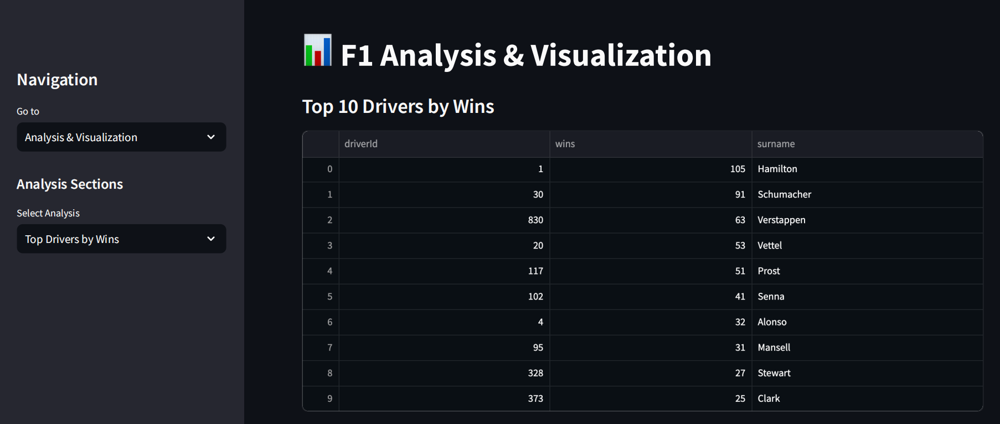
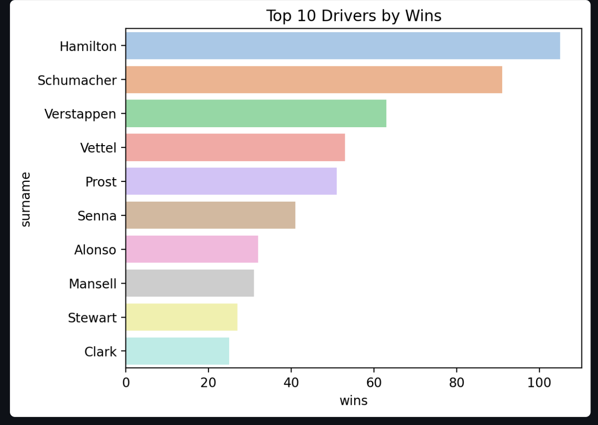
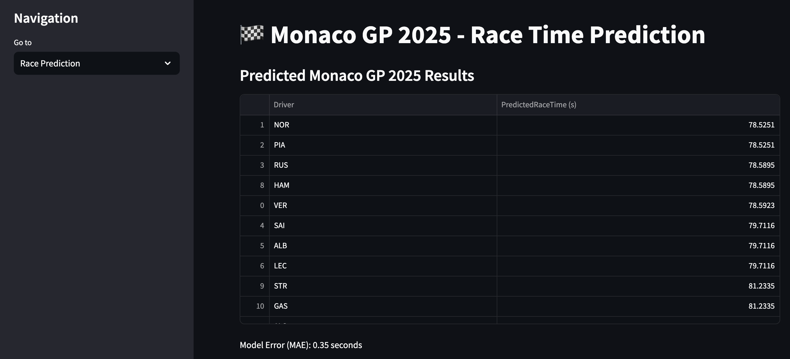
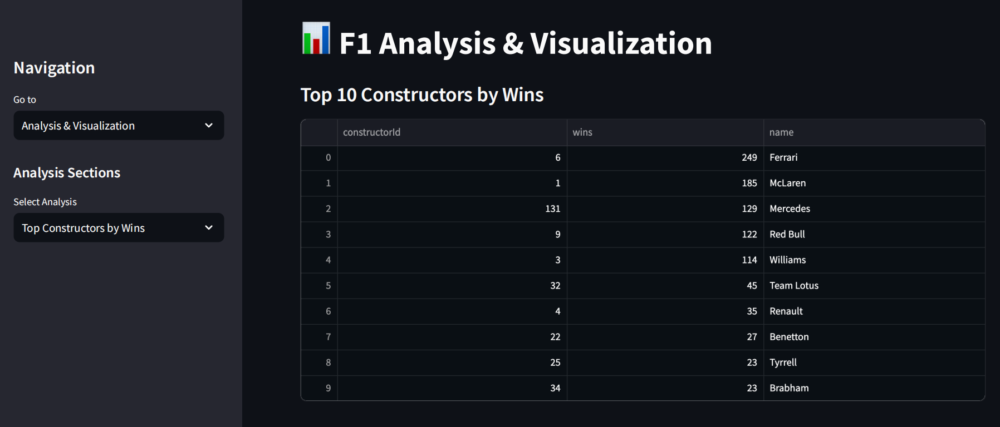
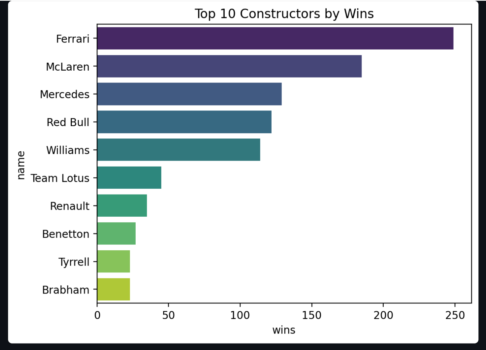

# Formula 1 Analysis, Visualization, and Prediction 

This project is an end-to-end Formula 1 analytics platform that explores race data through detailed analysis, interactive visualizations, and predictive modeling to uncover performance insights and forecast race outcomes.

## Overview

The project is divided into three major parts:
1. **Data Analysis** - Exploring and cleaning Formula 1 datasets for insights.
2. **Visualization** - Creating interactive charts and plots to understand trends and performance.
3. **Prediction Model** - Implementing a prediction model to forecast race outcome using machine learning.

## Features

- **Race Analysis:** Analyze race data across multiple seasons (2022, 2023, 2024).
- **Visualization:** Interactive graphs for analyzing driver performance, team performance, qualifying times, pit stops, and more.
- **Prediction Model:** Predict race result using XGBoost model trained on previous race data.
- **User Interface:** Streamlit-based UI with tabs for navigation between analysis, visualization, and prediction.

---

## Streamlit Dashboard

---

## Installation

**Clone the repository**
git clone https://github.com/Moksh-Fadia/Formula-1-Analysis-and-Visualization.git
cd Formula-1-Analysis-and-Visualization

---

-> Usage:
Run the application with Streamlit:

streamlit run prediction.py
The application will be hosted on http://localhost:8501/

Data Sources: Multiple CSV files like results.csv, driver_standings.csv, pitstops.csv, qualifying.csv, etc.
Visualizations: Created using Matplotlib and Seaborn.
Insights: Displayed using Streamlit.

Evaluation:
Metric: Mean Absolute Error (MAE)
Performance: Displayed in the application UI.

